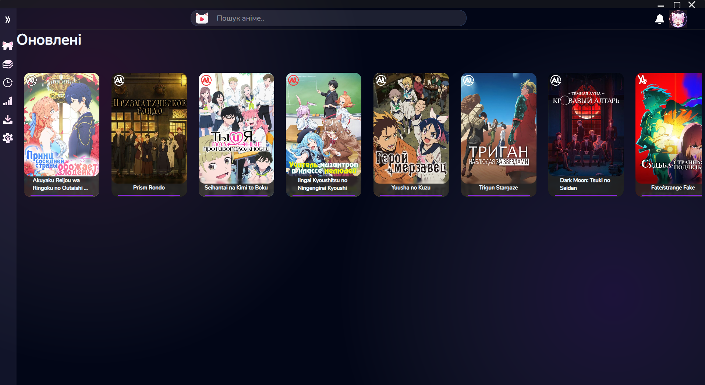

# ReAniPlay 

A high-performance, cross-platform desktop media ecosystem built specifically for 2D animation enthusiasts. 

ReAniPlay challenges the modern standard of bloated, resource-heavy Electron wrapper applications. Built entirely on **C# and Avalonia UI**, it delivers a native, lightweight desktop experience combined with advanced real-time video processing and seamless backend synchronization.

  

  <em>Native Avalonia UI cross-platform interface. Zero web-views, minimal memory footprint.</em>

 

  

  <em>Custom video pipeline interface with real-time GPU shader integration capabilities.</em>

 
## The Problem vs. The Solution

**The Problem:** Modern media players and streaming web platforms rely heavily on browser engines, resulting in high RAM usage, poor hardware decoding optimization, and heavy compression artifacts (color banding, blocking) typical in standard H.264 streams for 2D animation.

**The Solution:** ReAniPlay utilizes native desktop rendering and GPU-accelerated compute shaders to upscale and filter low-bitrate video in real-time, effectively restoring image fidelity without burdening the CPU.

## Tech Stack

**Frontend / Desktop Client:**
* **Language:** C# (.NET 8)
* **Framework:** Avalonia UI (Cross-platform GUI)
* **Graphics/Video Processing:** ComputeSharp (HLSL Compute Shaders), Anime4K algorithms.

**Backend / API:**
* **Framework:** ASP.NET Core Web API
* **Database:** PostgreSQL
* **ORM:** Entity Framework Core
* **Authentication:** JWT + Stateful Session Management (Refresh Token Rotation)
* **Hosting:** Railway / Cloudflare

## Key Engineering Features

### 1. Real-Time Shader Pipeline (Anime4K Integration)
Integrated real-time upscaling algorithms directly into the video rendering pipeline. Utilizing GPU compute shaders, the client can take a standard 720p source and upscale it to 1080p/1440p on the fly. This saves massive amounts of server bandwidth while providing the user with near-lossless visual quality.

### 3. Advanced Session-Based Authentication
Implemented an enterprise-grade authentication system. Instead of relying solely on stateless JWTs (which cannot be easily revoked), the backend utilizes a stateful session table in PostgreSQL.
* Generates short-lived Access Tokens (JWT).
* Utilizes single-use Refresh Tokens tied to specific hardware devices.
* Supports remote session revocation and background cleanup workers.

### 4. Zero-Bloat UI
Designed with an absolute focus on aesthetic minimalism and usability. No web-views, no trackers. The client synchronizes metadata (watch history, libraries) asynchronously via the custom Web API.

## Current Status & Roadmap

The project is currently in the **Alpha / MVP phase**.

This repository contains the application source code and architectural concepts. ReAniPlay is a media player and metadata synchronizer. It does not host, distribute, or contain any copyrighted video materials. 

Developed in Ukraine 🇺🇦
